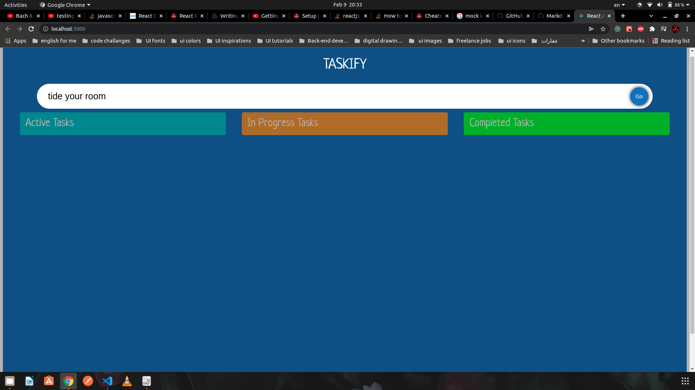
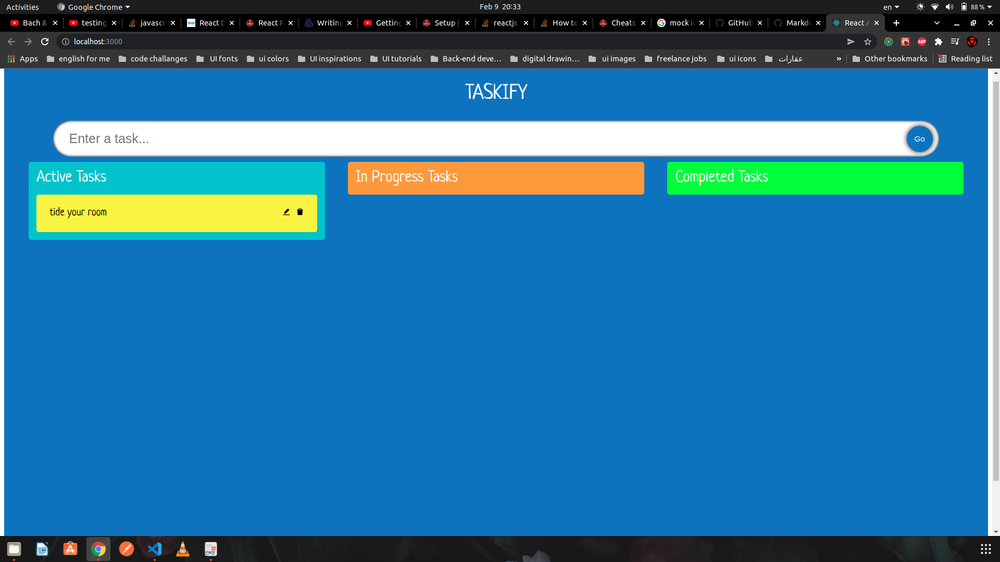
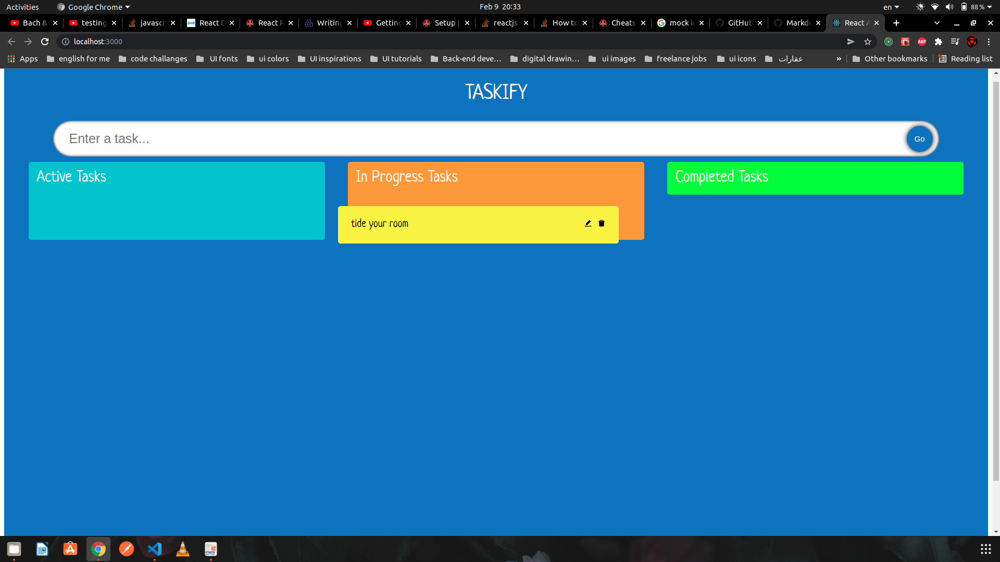
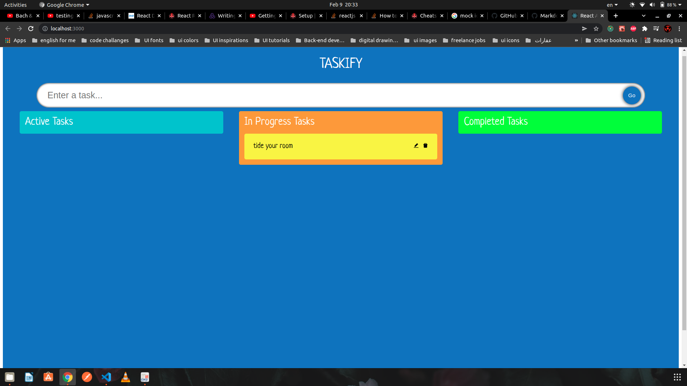
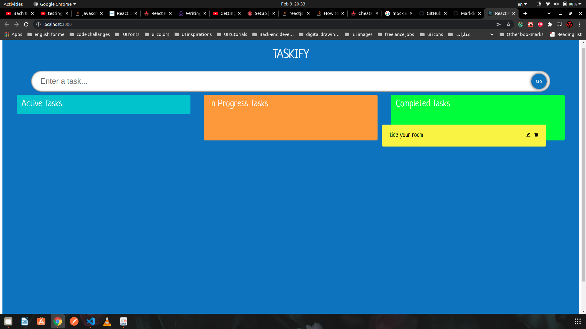
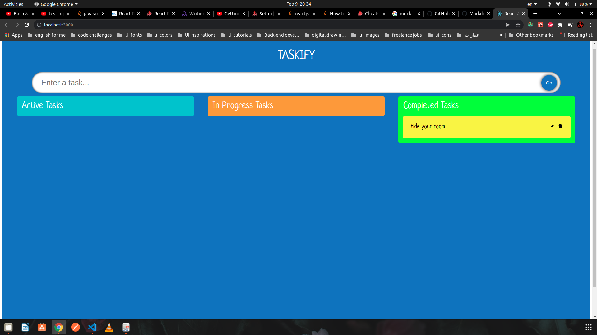
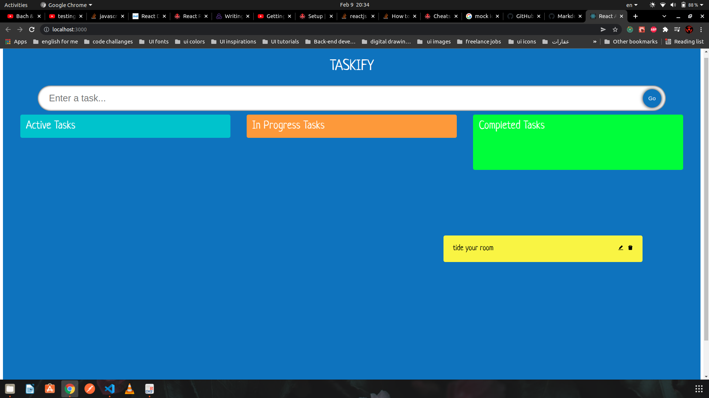
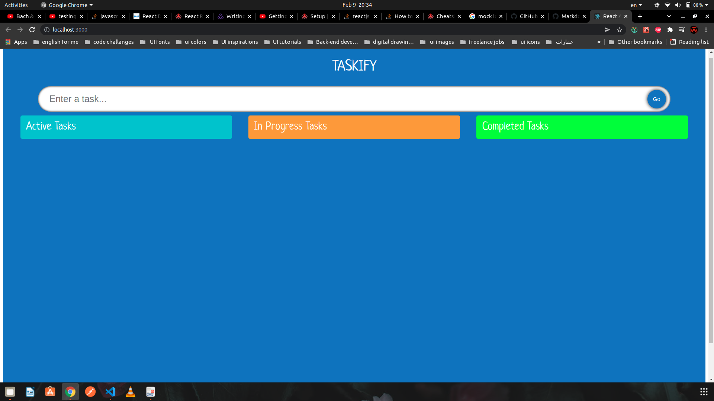

# Taskify App

This project was create as a Kanaban bored for monitoring your tasks.

## How It works

Basically you craete a task filling the following input

Hit Enter or click "Go" button and task will be added to "Active Tasks" column

Drag task card from "Active Tasks" column to "In-Progress Tasks" column or "Completed Tasks" column ;

Task card added to "In-Progress Tasks" column;

Drag task card from "In-Progress Tasks" column to "Completed Tasks" column ;

Drag task card from "In-Progress Tasks" column to "Completed Tasks" column ;

Drag task card from "Completed Tasks" column to nowhere to remove the task ;

Drag task card from "Completed Tasks" column to nowhere to remove the task ;

## what also can this app do

..*update task at any time
..*remove task at any time
..*save tasks for later use using indexedDB
..*save state locally using Redux
